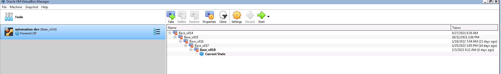
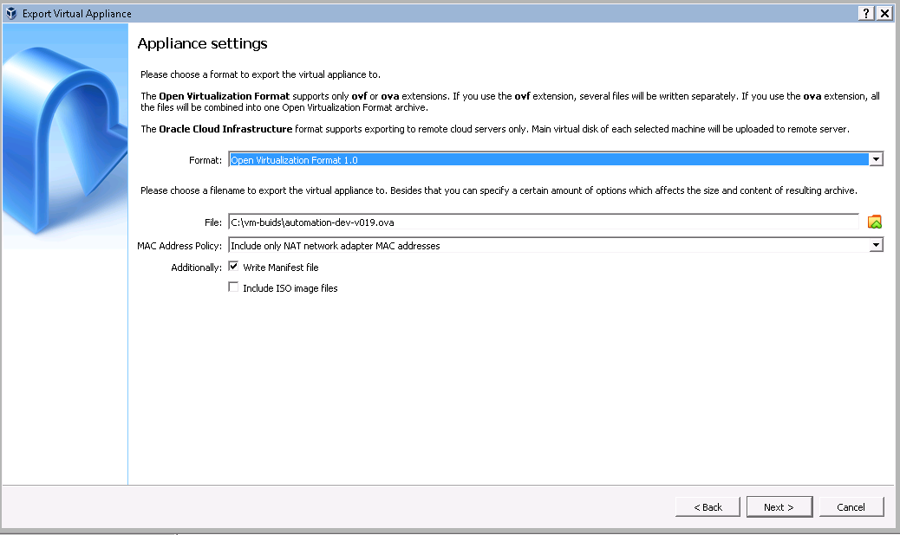

# Build a new VM Image

The build environment is located on a VM in the SALEM lab. The VM details are:

* IP - 10.59.4.228
* Username - automated_user
* Password - @utom@tion
* VNC Port - 3389

Once you log in as the automated_user you can find the previous VM version in the following directory: C:\vm-buids

# Create the virutal box image

First you can load up the current image on the virtual box application. This should be running or you can find as a shortcut on the desktop. 

You will need the current image that is loaded on the system. Start this image by pressing the start button.
Once the image is loaded you can use the WinSCP to connect to the VM image (also a short cut on the desktop). This is how you will copy over your ssh keys. You can use the windows explorer to view files on your local machine and copy your ssh keys to this machine. Use WinSCP to connect to the VM. The profile for administrator@192.168.56.107 should work and the password will be `extreme`. WinSCP should load up with the /automation/ directory on the remote VM. Copy your ssh keys from the host machine to this directory `/automation`.

On the VM you can login using the `administrator` and `extreme` credentials. Open a terminal window and issue the following commands:

     cd /automation
     python setup.py

Answer all of the question ( as you did copy the keys to the /automation directory). Next sync up the framework and test repos and update the version.txt file:

     cd /automation/tests/extreme_automation_tests
     git pull

     cd /automation/framework/extreme_automation_framework
     git pull

     cd /automation
     vi version.txt 

set the version to the next number, example: if version is 18.0.0 set to 19.0.0. Save the file.

# Make updates to VM

Next you can make updates to the VM. Be sure to execute a Pytest / Robot test in the case that you are making changes to the installed packages or IDE.

# Clean up the VM for export

Once you have made and tested your changes to the VM, you will need to clean up the VM for export. 

* Remove any report files that you have generated by running tests.
* Remove the `rm -rf ~/.ssh` directory and contents
* Remove the `rm -rf ~/.gitconfig` directory and contents
* Remove any downloaded files

Next shutdown the VM.

In Virtualbox take a snapshot of the new version and name it Base_v0<Your new version here>. You can right click on the image and choose `export to OCI...`

Format: Open Virtualization Format 1.0
Save the File as: C:\vm-buids\automation-dev-v0<Your new version here>.ova

see screen shot for details:

While that is exporting you can CD to C:\vm-builds in Window Explorer. Delete the preious version of the VM OVA and checksum files (.txt). Also remove the file: automation-dev-vmware-disk001.vmdk

After the VM is exported, CD to C:\vm-builds in Window Explorer. Right click on the automation-dev-v0<Your new version here>.ova and choose 7-zip->Open archive. Select the automation-dev-v0<Your new version here>-disk001.vmdk and copy it to C:\vm-build\automation-dev-vmware-disk001.vmdk.

# Create the VMWare image

Open a powershell window and issue the following commands to create the vmware ova image.

        cd C:\vm-builds
        ovftool.exe automation-dev-vmware.ovf automation-dev-vmware-v0<your new version here>.ova 

## Create the checksum for the virtualbox image.

* Open a powershell command window and issue the following commands:

        cd C:\vm-builds
        CertUtil -hashfile automation-dev-v0<your new version here>.ova MD5

* Once that command returns, create a new file called automation-dev-v0<your new version here>.txt and paste in the conetents of the output from the command.

## Create the checksum for the VMWare image.

* Open a powershell command window and issue the following commands:

        cd C:\vm-builds
        CertUtil -hashfile automation-dev-vmware-v0<your new version here>.ova MD5

* Once that command returns, create a new file called automation-dev-vmware-v0<your new version here>.txt and paste in the conetents of the output from the command.

## Upload to Artifactory

Open up a browser and http://engartifacts1.extremenetworks.com:8081/artifactory/webapp/#/artifacts/browse/tree/General/econ-extauto-env/vms. Login to artifactory and click deploy. I would deploy one file at a time. The format will be econ-extauto-env/vms/v0<your new version here>. Upload both ova (virtualbox and vmware) and the checksum files.

