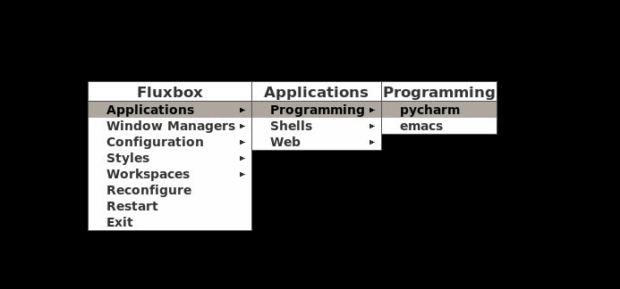
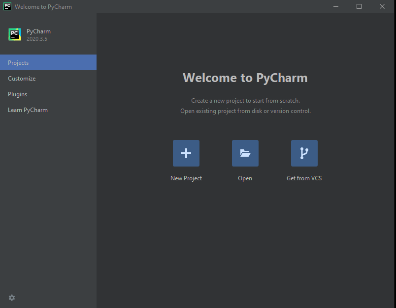
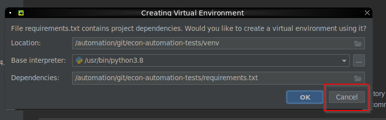
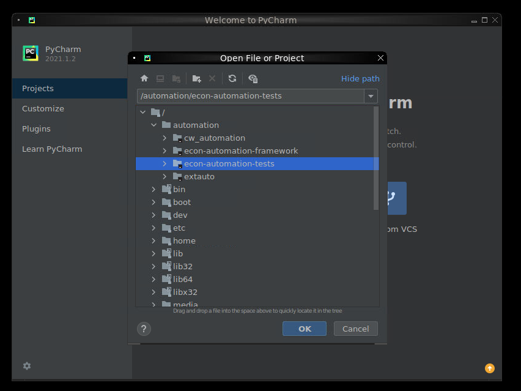
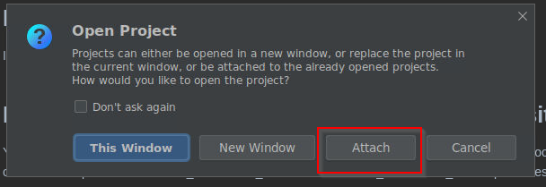
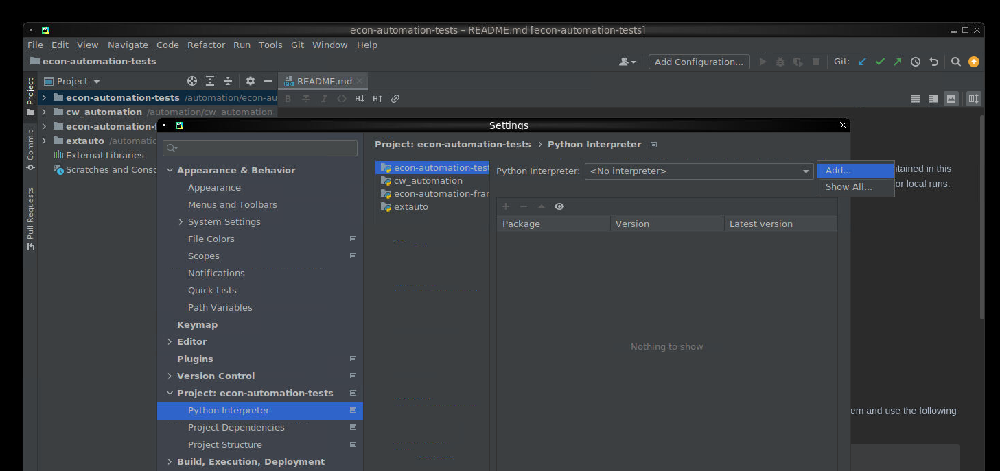
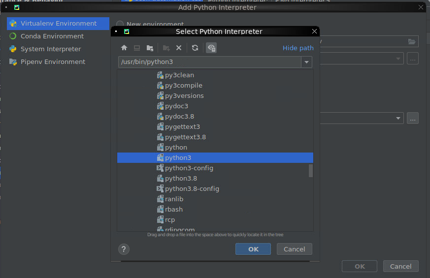
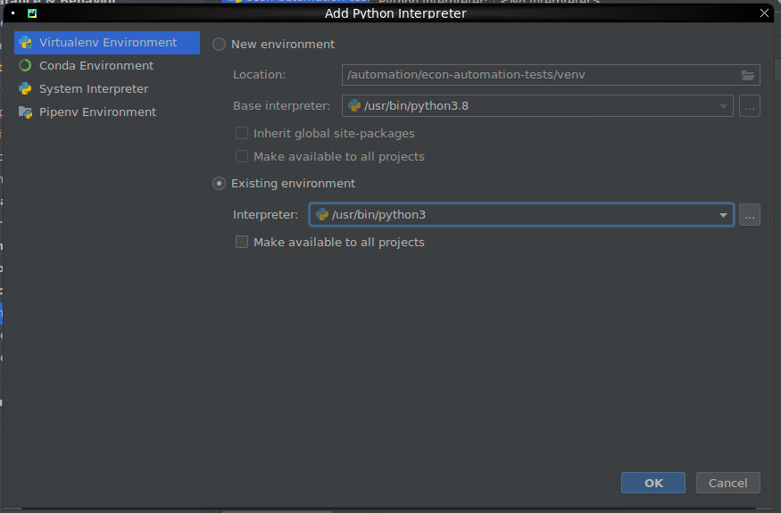
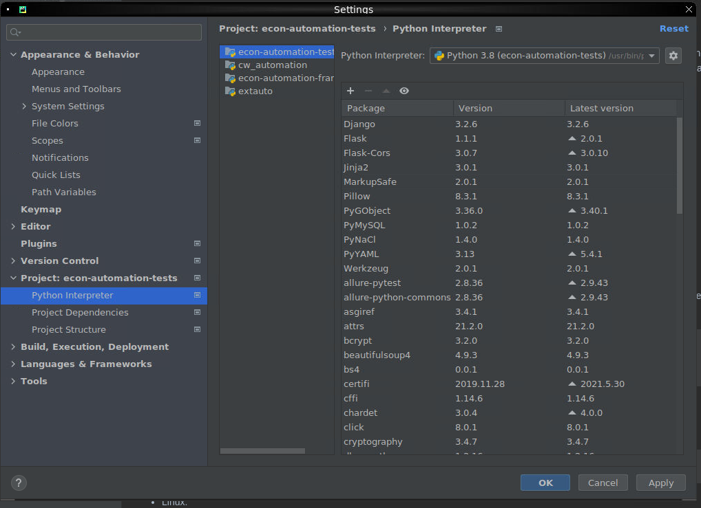
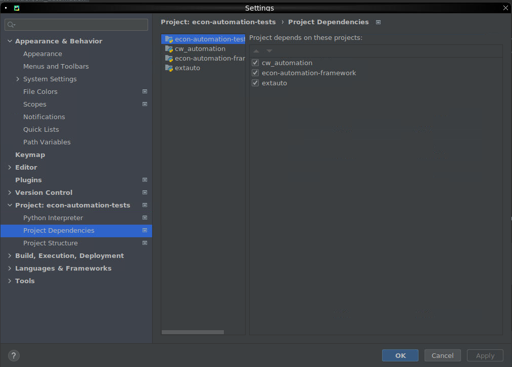

# Setting up the Extreme Automation Docker Image

This docker image contains all of the tools that are needed to run the econ and extauto frameworks.  You will need two external directories that will be mounted into the container.  These directories will manage your ssh keys and store test results on your host machine.

To get started please follow these instructions:

1. Install docker on the host machine
   
   Linux:

    [Docker Install Linux Directions](https://docs.docker.com/engine/install/)

   Windows:

    [Docker Install Windows Directions](https://docs.docker.com/docker-for-windows/install/)

1. Linux only: Install docker-compose

    [Docker Compose Directions](https://docs.docker.com/compose/install/)

1. Create a directory in the root of the host file system called `automation` and a subdirectory called `git`
   
   NOTE: The directory you work from cannot be an NFS mounted directory.  It must be a directory on your hard drive.
   NOTE: For Linux, the path from which the `automation` directory is created will be stored in a local environmental variable and used in future steps.

    Linux:

        mkdir automation
        export AUTO_DIR=$(pwd)/automation
        mkdir $AUTO_DIR/git
        cd $AUTO_DIR/git/

    Windows:

        md c:\automation
        md c:\automation\git
        cd c:\automation\git

1. Issue the following git clone commands in the automation/git directory to clone all of the repositories:

        git clone git@github.com:extremenetworks/extreme_automation_framework.git
        git clone git@github.com:extremenetworks/extreme_automation_tests.git
        git clone git@github.extremenetworks.com:Engineering/cw_automation.git
           
   Note: If you are unable to clone the repositories or do not have access to the repositories please send an e-mail to helptools@extremenetworks.com. You can test access by attempting to view the repositories using a browser: https://github.com/extremenetworks/extreme_automation_tests, https://github.com/extremenetworks/extreme_automation_framework, https://github.extremenetworks.com/Engineering/cw_automation 

1. Create a directory in `automation` called `home`. Within that new directory create another directory called `.ssh` and copy your ssh keys that you already use for GIT into that directory.

    NOTE: The commands below include commands to copy ed25519 keys AND rsa keys.  Two of the commands should be expected to fail because you likely won't have both types of keys.  If you have other types of ssh keys you will need to copy them manually.
  
    Linux:

        cd $AUTO_DIR
        mkdir home
        mkdir home/.ssh
        chmod 700 home/.ssh
        chmod 777 home
        cp ~/.ssh/id_ed25519 home/.ssh/
        cp ~/.ssh/id_ed25519.pub home/.ssh/
        cp ~/.ssh/id_rsa home/.ssh/
        cp ~/.ssh/id_rsa.pub home/.ssh/

    
    Windows:

        md C:\automation\home\.ssh
        md C:\automation\home
        cd C:\automation\home\.ssh
        cp C:\Users\$env:UserName\.ssh\id_rsa .
        cp C:\Users\$env:UserName\.ssh\id_rsa.pub .
        cp C:\Users\$env:UserName\.ssh\id_ed25519 .
        cp C:\Users\$env:UserName\.ssh\id_ed25519.pub .
        
    
    Note: You will use the `automation/git` and `automation/home` directories as volumes for your docker image. id_rsa 
        
1. Download the pre-built docker image:

        docker pull ghcr.io/extremenetworks/extreme_automation_framework/automation-dev-env:latest
        
    Note: If you have not logged into the GitHub container registry for Docker you must complete the following steps before your "docker pull" command will work:
  
        a. Log in to your GitHub.com account, go to "Settings->Developer settings->Personal access tokens" and create a token with "read:packages" permissions
        b. Copy the Token to your clipboard
        c. Click "Enable SSO"
        d. Export the PAT to your ENV, "export CR_PAT=<paste access token from clipboard>"
        e. Perform a 'docker login' to the registry, "echo $CR_PAT | docker login ghcr.io -u <your github.com user name> --password-stdin"
        f. docker pull ghcr.io/extremenetworks/extreme_automation_framework/automation-dev-env:latest

1. Once the docker downloaded you can check for it by issuing the following command:

        docker images

        REPOSITORY                                                                TAG                     IMAGE ID       CREATED        SIZE
        ghcr.io/extremenetworks/extreme_automation_framework/automation-dev-env   latest                  a1a976f3ab06   6 days ago     6.23GB
        selenium/node-firefox                                                     4.0.0-beta-4-20210608   37a5d9470587   7 months ago   1.06GB
        selenium/node-chrome                                                      4.0.0-beta-4-20210608   6eb85b0794dc   7 months ago   1.14GB
        selenium/hub                                                              4.0.0-beta-4-20210608   601345179064   7 months ago   364MB
   

1. Change the directory to `automation/git/extreme_automation_framework/vm_env/docker`

    Linux:

        cd $AUTO_DIR/git/extreme_automation_framework/vm_env/docker

    Windows:
   
        cd C:\automation\git\extreme_automation_framework\vm_env\docker
   
1. **Linux only**: Edit the 'docker-compose.yaml' file. You'll need to change the directories in the "volumes:' section to point to the directories that you have been working with.  The following commands can be used to generate the "volumes" lines for the yaml files.  The docker-compose.yaml file is already configured for Windows and doesn't not require any changes (assuming the directories used match these instructions).

    Linux Only:

        echo $AUTO_DIR/git:/automation/git
        echo $AUTO_DIR/home:/home/administrator

    Example volumes lines:

        volumes:
          - /docker_automation_env/automation/git:/automation/git
          - /docker_automation_env/automation/home:/home/administrator

    Note: The directory before the ':' is the full path of the directories you've been working with.  Keep everyting after the ':' the same.

1. **Linux Only**: Create a local user with id 1202 change ownership of all the files and directories to that user then log in as the new user.  This steps allows you to modify the repository files from within the container.

        sudo adduser -c "Local Automation User for automation docker containers" -u 1202 -M -s "/bin/bash" seluser
        cd $AUTO_DIR
        sudo chown -R seluser:seluser *
        
1. Start the docker images with the docker compose file:

    Linux:
    
        cd $AUTO_DIR/git/extreme_automation_framework/vm_env/docker
        docker-compose up

    Windows:
    
        cd c:\automation\git\extreme_automation_framework\vm_env\docker
        docker-compose up
    

## Accessing the environment:
Once the docker images are running, you can access them via a browser or a VNS Viewer.

Accessing the containers from a browser:

- Selenium Grid: [http://localhost:4444/ui/index.html#/](http://localhost:4444/ui/index.html#/)
- noVNC - Dev machine: [http://localhost:7900/](http://localhost:7900/)
- noVNC - Chrome: [http://localhost:7901/](http://localhost:7901/) Password: secret
- noVNC - Firefox: [http://localhost:7902/](http://localhost:7902/) Password: secret
- noVNC - Edge: [http://localhost:7903/](http://localhost:7903/) Password: secret (Note: edge is currently disabled)

You can access the images via a browswer using noVNC as listed above or you can also access them using a VNC client like TightVNC or MobaXterm.  The ability to copy and paste into the image is better outside of the browser.  When using the browser you will need to use the clipboard that is available in the tools widget on the left hand side of your screen.
   
Access the containers from a VNC Viewer:

- Dev machine: localhost:5901
- Chrome: localhost:6900 Password: secret
- Firefox: localhost:6902 Password: secret
- Edge:  localhost:6901 Password: secret (Note: edge is currently disabled)

## Setup the pycharm IDE:

### Creating a New Pycharm Project

You can start up pycharm in the docker developer image clicking the panel menu (lower left of screen) and selecting Programming->pycharm.

Confirm the user agreement (check the checkbox) and click on continue. With Pycharm started, there should be a `Welcome to PyCharm` window open. Select the `Open` button if that windows doesn't show up. You can select open from the top menu: navigate to File-->Open...

When asked to create a Virtual Environment click `Cancel`:

Next you will load each of the four repositories into your project: Start with `econ-automation-tests`.  The remaining repositories `econ-automation-framework`, `extauto` and `cw_automation` will be attached to the same project.

1. From the PyCharm UI, navigate to File-->Open... Navigate to `extreme_automation_tests` directory... Click `OK`
1. From the PyCharm UI, navigate to File-->Open... Navigate to `extreme_automation_framework` directory... Click `OK`... Select 'Attach'... Click `OK`
1. From the PyCharm UI, navigate to File-->Open... Navigate to `cw_automation` directory... Click `OK`... Select 'Attach'... Click `OK`

    
    

## Configuration of the Environment
In order to execute tests the user must configure the python environment for PyCharm.

1. Select File --> Settings from the top level menu
1. Under settings on the left hand tree select Project: econ-automation-tests and expand that to show the Python Interpreter and click on it
1. The right hand screen will show the list of Python Interpreter this should be empty
1. Select the gear button next to the drop down for Python Interpreter and click on `Add`

    

  
1. Select Existing environment located in /usr/bin/python click on the `...` button to add your environment
1. Select the directory that the python3 execuable it located in and click `OK`

    

1. Make sure the check the Make available to all project check box and click `OK`

    

1. Next select the `econ-automation-framework`, `extauto` and `cw_automation` project(s) and select the same python interpreter. You should be able to use the dropdown and select the `Show All...` button to see the new python environment

    

1. Next select the Project Dependencies and select the all of the other projects for all of the projects: `econ-automation-tests`, `econ-automation-framework`, `extauto` and `cw_automation`

    

1. Once Pycharm is done loading the configurations you can add a new test
